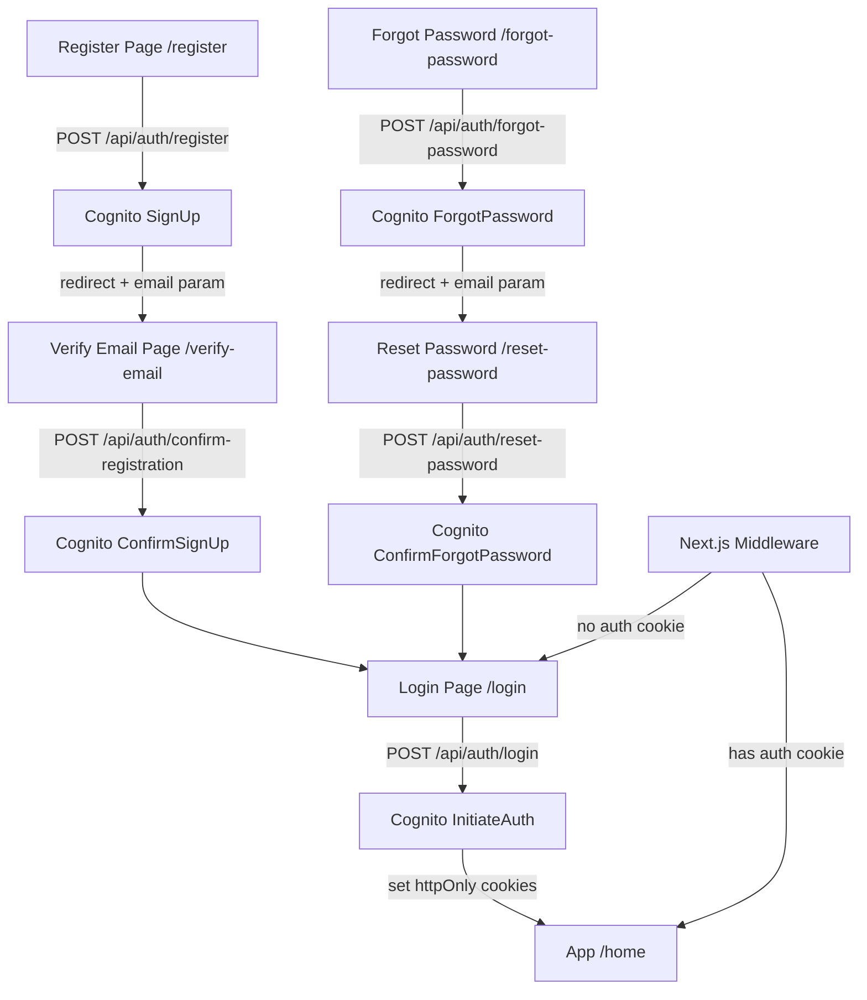

# Cognito Authentication Flow

## Architecture Overview




## Packages to Install

- `@aws-sdk/client-cognito-identity-provider` — AWS SDK v3 Cognito client (server-side only)

## Environment Variables to Add (`.env`)

- `COGNITO_USER_POOL_ID` — from Serverless output `UserPoolId`
- `COGNITO_CLIENT_ID` — from Serverless output `UserPoolWebClientId`
- `AWS_REGION` — `us-east-1`

## New Files

### Infrastructure

- `src/lib/cognito.ts` — Singleton `CognitoIdentityProviderClient`, exports `cognitoClient`, `COGNITO_CLIENT_ID`, `COGNITO_USER_POOL_ID`

### API Routes

- `src/app/api/auth/register/route.ts` — **Replace** Prisma/bcrypt with Cognito `SignUpCommand`
- `src/app/api/auth/confirm-registration/route.ts` — Cognito `ConfirmSignUpCommand` (POST `{ email, code }`)
- `src/app/api/auth/login/route.ts` — Cognito `InitiateAuthCommand` (`USER_PASSWORD_AUTH`), sets three httpOnly cookies (`accessToken`, `idToken`, `refreshToken`)
- `src/app/api/auth/logout/route.ts` — Clears the three auth cookies
- `src/app/api/auth/forgot-password/route.ts` — Cognito `ForgotPasswordCommand` (POST `{ email }`)
- `src/app/api/auth/reset-password/route.ts` — Cognito `ConfirmForgotPasswordCommand` (POST `{ email, code, newPassword }`)

### Pages & Forms

- `src/app/verify-email/page.tsx` + `src/components/verify-email-form.tsx` — Reads `?email=` from URL, form for 6-digit code
- `src/app/forgot-password/page.tsx` + `src/components/forgot-password-form.tsx` — Email input, on success redirects to `/reset-password?email=`
- `src/app/reset-password/page.tsx` + `src/components/reset-password-form.tsx` — Code + new password + confirm password, on success redirects to `/login`

### Middleware

- `src/middleware.ts` — Checks for `accessToken` cookie; redirects unauthenticated requests from `/(app)` routes to `/login`, redirects authenticated users away from `/login`, `/register`, `/forgot-password`, `/reset-password`

## Modified Files

- `src/components/login-form.tsx` — Add "Forgot your password?" link pointing to `/forgot-password`
- `src/components/register-form.tsx` — Update `onSuccess` to `router.push('/verify-email?email=...')` (email passed via query param)
- `src/hooks/mutations/use-auth-mutations.ts` — Add `useConfirmRegistration`, `useForgotPassword`, `useResetPassword` mutations; update `LoginUserResponse` to remove Prisma fields
- `src/utils/validation-schemas.ts` — Add `confirmRegistration` and `resetPassword` Zod schemas; export their types

## Cookie Strategy (Login Route)

```typescript
// httpOnly, secure in production, 30-day refresh token, 1-hour access token
response.cookies.set('accessToken', tokens.AccessToken, { httpOnly: true, secure, sameSite: 'strict', maxAge: 3600 })
response.cookies.set('idToken',     tokens.IdToken,     { httpOnly: true, secure, sameSite: 'strict', maxAge: 3600 })
response.cookies.set('refreshToken',tokens.RefreshToken, { httpOnly: true, secure, sameSite: 'strict', maxAge: 60 * 60 * 24 * 30 })
```

## Cognito Error Mapping

Cognito throws named errors (`UsernameExistsException`, `CodeMismatchException`, `NotAuthorizedException`, etc.) — these will be caught and mapped to the existing `handleAPIError` / field-error response format that the forms already handle.