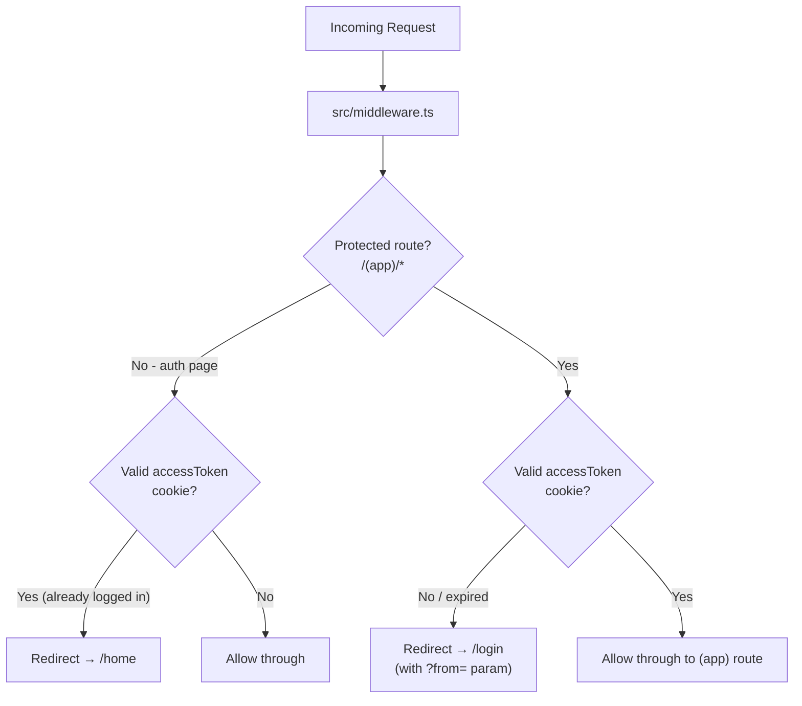

# Route Protection Middleware

> This plan executes **after** the Cognito Auth Flow plan is complete.

## Route Map




## JWT Verification Strategy

Next.js middleware runs on the **Edge runtime** — the full AWS SDK is not available. Instead, the `jose` library (lightweight, Edge-compatible) is used to verify the Cognito `accessToken` against Cognito's public JWKS endpoint.

- Cognito JWKS URL: `https://cognito-idp.{AWS_REGION}.amazonaws.com/{COGNITO_USER_POOL_ID}/.well-known/jwks.json`
- `jose` caches the JWKS in memory automatically for performance
- Token expiry is verified as part of `jwtVerify`

## Protected vs Public Routes

- **Protected** (require valid JWT): all paths matched by `/(app)/(.*)` — currently `/home`, `/board/:id`, `/test`, and any future routes added to that group
- **Public auth pages** (redirect away if already logged in): `/login`, `/register`, `/forgot-password`, `/reset-password`, `/verify-email`
- **Fully public** (no redirect either way): `/` (root), `/api/`*

## Package to Install

- `jose` — JWKS-based JWT verification on Edge runtime

## Files

### New Files

- `src/lib/auth.ts` — `verifyAccessToken(token: string): Promise<boolean>` helper using `jose`; reads `COGNITO_USER_POOL_ID` and `AWS_REGION` from env
- `src/middleware.ts` — main middleware logic:
  1. Skip `/api/`* and static assets (`/_next/*`, `/favicon.ico`)
  2. Read `accessToken` from `request.cookies`
  3. Call `verifyAccessToken()` → returns `true | false`
  4. If protected route + invalid token → `NextResponse.redirect('/login?from={pathname}')`
  5. If auth page + valid token → `NextResponse.redirect('/home')`
  6. Otherwise → `NextResponse.next()`

### Modified Files

- `.env` — Add `NEXT_PUBLIC_COGNITO_USER_POOL_ID` and `NEXT_PUBLIC_AWS_REGION` (middleware reads env vars at Edge; non-secret values can be `NEXT_PUBLIC_`)
- **Remove the `middleware` todo from the auth flow plan** — this plan fully covers it

## Middleware Matcher Config

```typescript
export const config = {
  matcher: [
    '/((?!_next/static|_next/image|favicon.ico|api).*)',
  ],
}
```

## `src/lib/auth.ts` Sketch

```typescript
import { createRemoteJWKSet, jwtVerify } from 'jose'

const JWKS_URL = `https://cognito-idp.${process.env.AWS_REGION}.amazonaws.com/${process.env.COGNITO_USER_POOL_ID}/.well-known/jwks.json`
const JWKS = createRemoteJWKSet(new URL(JWKS_URL))

export const verifyAccessToken = async (token: string): Promise<boolean> => {
  try {
    await jwtVerify(token, JWKS)
    return true
  } catch {
    return false
  }
}
```

## `src/middleware.ts` Sketch

```typescript
const protectedRoutes = ['/home', '/board', '/test']
const authRoutes = ['/login', '/register', '/forgot-password', '/reset-password', '/verify-email']

// Check if path starts with a protected prefix
// Read cookie → verify → redirect or allow
```

